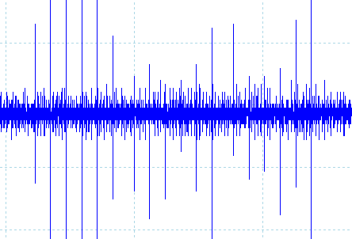

# Keyboard Tools

This sub-toolkit is for capturing the EM emissions from a keyboard, similar to the work of Martin Vuagnoux and Sylvaini Pasini (see: lasecwww.epfl.ch/keyboard), and further expanded on in "SoK: Keylogging Side Channels" (see: ieeexplore.ieee.org/document/8418605).

Type 1 is J Burrows
Type 2 is Anko / MS (wip)
Type 3 is Cherry (wip)
